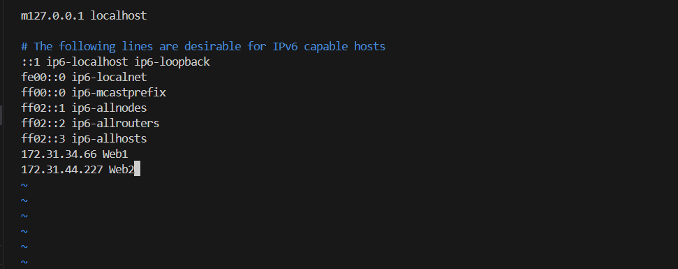
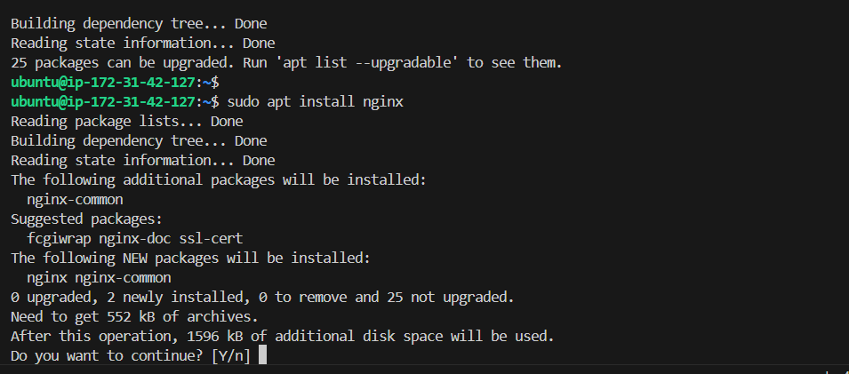
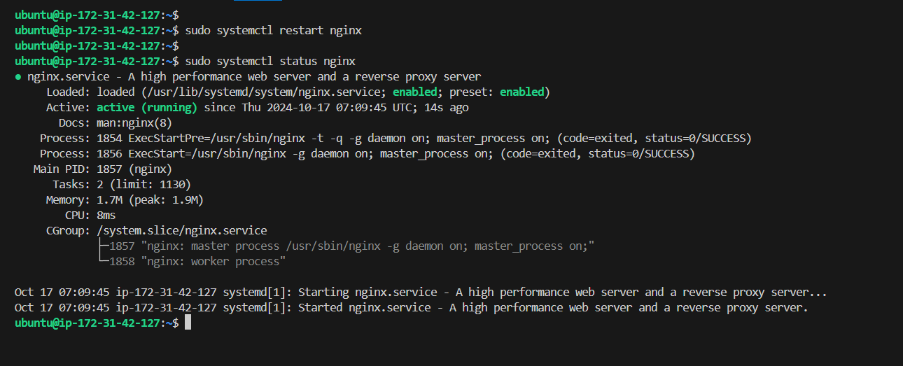
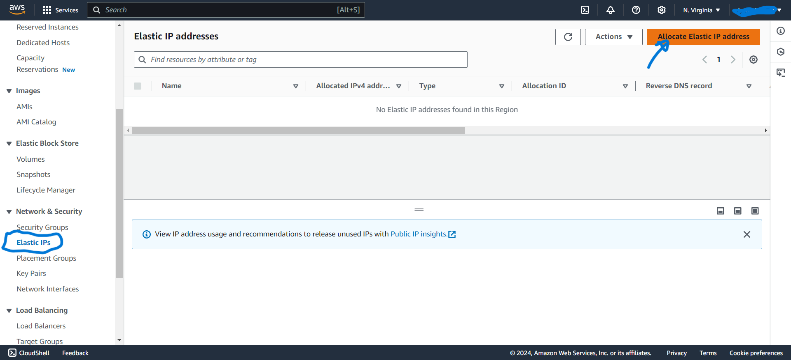
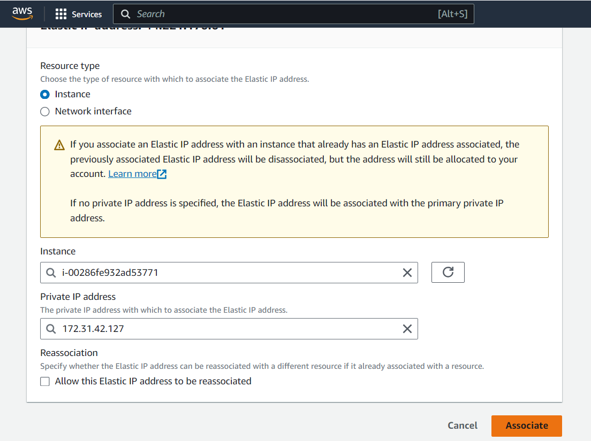
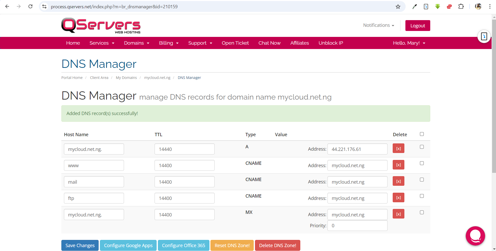
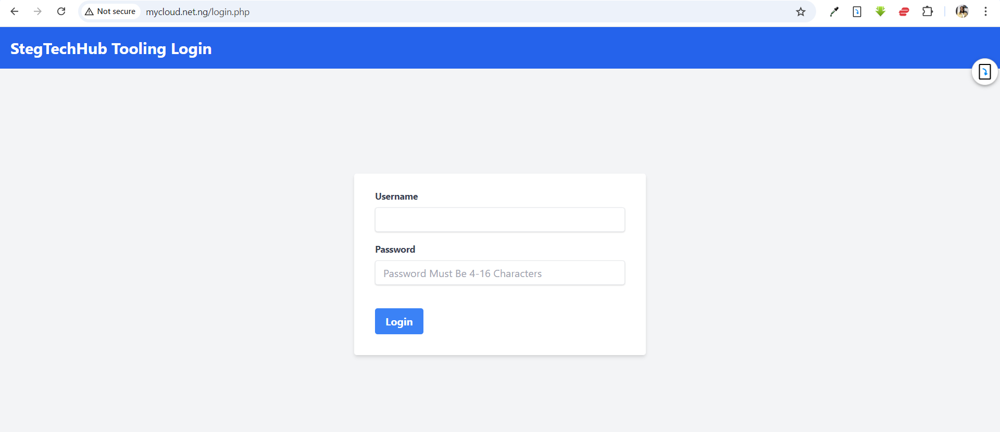
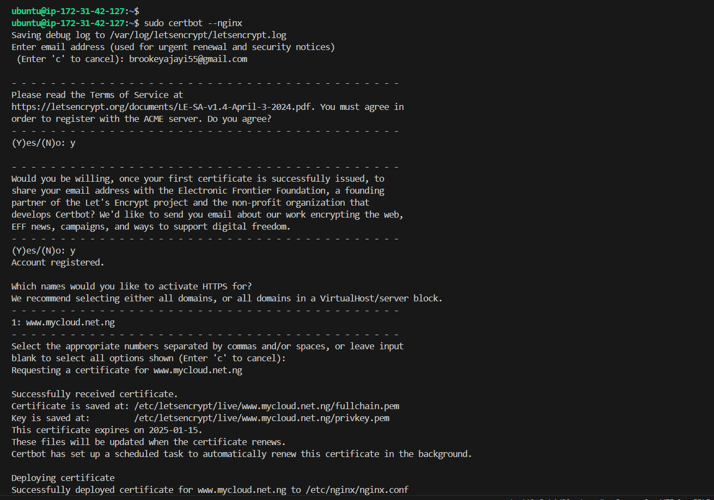
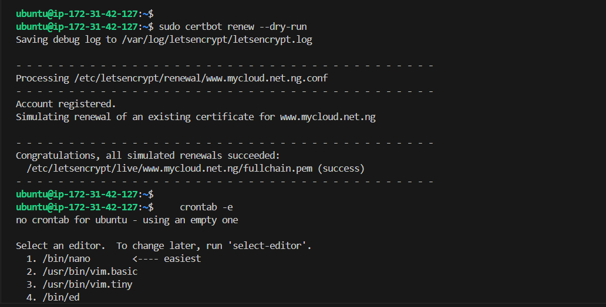
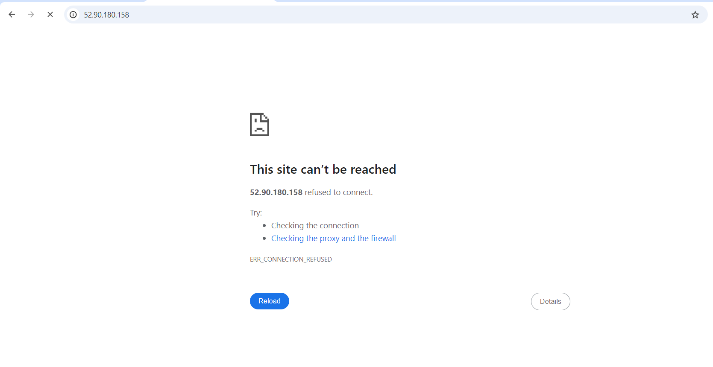

# Load Balancer Solution with Nginx and SSL/TLS

## Introduction

In this project, we will configure an Nginx Load Balancer solution and ensure secure connections using SSL/TLS certificates. 

We’ll explore:
- Configuring Nginx as a Load Balancer.
- Registering a domain name and configuring secure connections using SSL/TLS.

When data moves between a client (browser) and a web server over the internet, it can pass through multiple network devices. If the data isn't encrypted, it can be intercepted via Man-In-The-Middle (MITM) attacks. Using SSL/TLS protects against this by encrypting the session between the browser and web server.

### What You'll Learn
- How to configure Nginx as a Load Balancer.
- How to secure your web solution using SSL/TLS certificates.

   

---

## Project Overview

This project consists of two parts:

1. **Configure Nginx as a Load Balancer**
2. **Register a domain and configure SSL/TLS certificates**

---

## Part 1: Configure Nginx as a Load Balancer

### Step 1: Set Up Nginx on an EC2 Instance
1. **Create an EC2 VM** based on Ubuntu Server 24.04 LTS, and name it `Nginx-lb`.
   - Open TCP port **80** for HTTP connections.
   - Open TCP port **443** for HTTPS connections.
   
   

2. **Update the `/etc/hosts` file** for local DNS with the web servers' names (e.g., `Web1`, `Web2`) and their local IP addresses.
   
   
   

3. **Install and Configure Nginx as a Load Balancer**.
   - Update the system and install Nginx:
     ```bash
     sudo apt update
     sudo apt install nginx
     ```
   

### Step 2: Configure Nginx
1. **Open the Nginx configuration file**:
   ```bash
   sudo vi /etc/nginx/nginx.conf
   ```
   

2. **Insert the following configuration** into the `http` section:
   ```nginx
   upstream myproject {
       server Web1 weight=5;
       server Web2 weight=5;
   }

   server {
       listen 80;
       server_name www.domain.com;

       location / {
           proxy_pass http://myproject;
       }
   }
   ```
   

3. **Comment out this line**:
   ```nginx
   # include /etc/nginx/sites-enabled/*;
   ```
   

4. **Restart Nginx** to apply the changes:
   ```bash
   sudo systemctl restart nginx
   sudo systemctl status nginx
   ```
   

---

## Part 2: Register a Domain and Configure SSL/TLS Certificates

### Step 1: Register a Domain Name
1. **Register a domain name** using any domain registrar (e.g., GoDaddy, Bluehost). For this project I used Qservers.ng
   

2. **Assign an Elastic IP** to your Nginx server and associate your domain name with this Elastic IP.
   - Follow [this guide](https://docs.aws.amazon.com/vpc/latest/userguide/vpc-ip-addressing.html) to allocate an Elastic IP and associate it with your EC2 instance.
   
   
   
   

3. **Update the A record** in your domain registrar to point to the Elastic IP of your Nginx server.
   

### Step 2: Configure Nginx for Your Domain Name
1. **Update your Nginx configuration** file:
   ```bash
   sudo vi /etc/nginx/nginx.conf
   ```

2. **Change the `server_name`** value to your new domain:
   ```nginx
   server_name www.<your-domain-name>.com;
   ```
   

3. **Restart Nginx** to apply the changes:
   ```bash
   sudo systemctl restart nginx
   ```
   

### Step 3: Install Certbot and Request an SSL Certificate
1. **Ensure the `snapd` service is active**:
   ```bash
   sudo systemctl status snapd
   ```
   

2. **Install Certbot**:
   ```bash
   sudo snap install --classic certbot
   ```
   

3. **Request an SSL certificate**:
   ```bash
   sudo ln -s /snap/bin/certbot /usr/bin/certbot
   sudo certbot --nginx
   ```
   

4. **Test secured access** to your website by visiting `https://<your-domain-name>.com`.
   

### Step 4: Set Up SSL/TLS Certificate Renewal
1. **Test the certificate renewal command**:
   ```bash
   sudo certbot renew --dry-run
   ```
   

2. **Set up a cron job** to renew the SSL certificate automatically:
   ```bash
   crontab -e
   ```

3. **Add the following line** to schedule certificate renewal twice a day:
   ```bash
   * */12 * * * root /usr/bin/certbot renew > /dev/null 2>&1
   ```
   

---
## Errors
1. Nginx Ip not displaying:
   
2. Web Servers not displaying
   

**Solution:**  
- Connect to the web server on terminal, and run the command to check httpd status and start it.
```bash
   sudo systemctl status httpd
   sudo systemctl start httpd
```
   

## Congratulations!

You have successfully:
- Configured an Nginx Load Balancer.
- Secured your web solution with HTTPS using SSL/TLS certificates.
   
